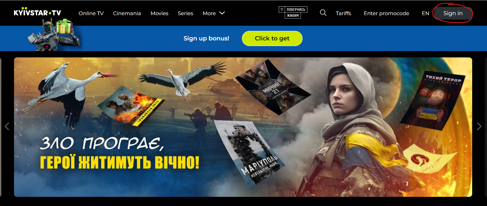
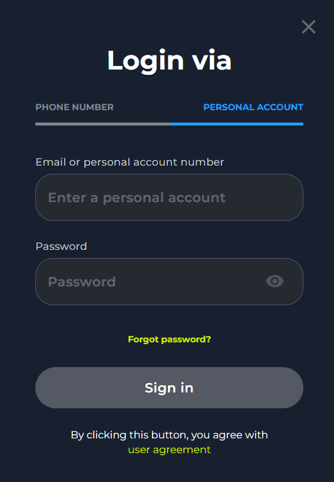
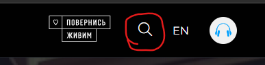
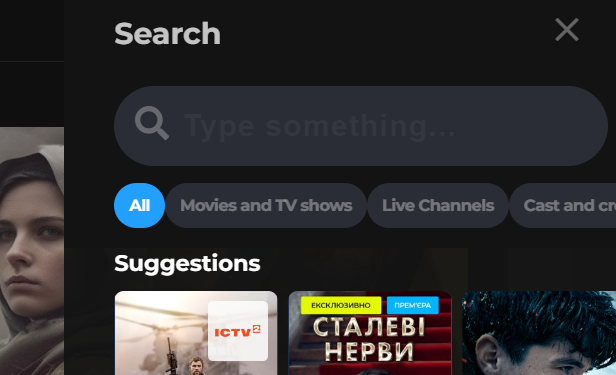
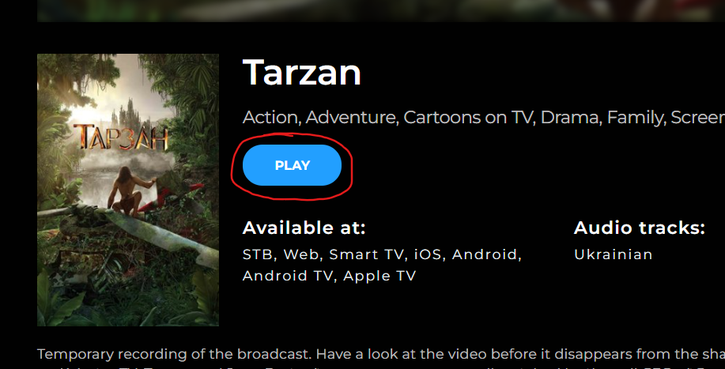

# Tutotial: Get started with **Kyivstar TV**

**Kyivstar TV**  is an interactive television service with legal 
content from Ukrainian and international TV channels in HD and standard quality. 
It also includes a library of movies, TV shows, cartoons, and shows. You can watch Kyivstar TV on various devices such as Smart TVs, Android TVs, iOS and Android devices.

## Compatible with the following OS:

- Smart TV
- Android TV
- Apple TV
- iOS
- Android
- **Also have web-brouser version**

    #### Compatible with the following browsers:
    - Google chrome
    - Firefox
    - Edge
    - Opera
    - Safari

## Minimum requirements

- Stable internet connection
- Suitable device or web-broser described above ([here](#compatible-with-the-following-os))
- 100 MB of memory on your device (for mobile and TV)

## Recommended requirements

- Stable internet connection
- Suitable device or web-broser described above ([here](#compatible-with-the-following-os))
- Suitable tariff plan 
    - To order a tariff plan, call the following numbers:
        - Dial **466** or **460** from your mobile
        - Dial **0 800 300 466** from a landline or another mobile operator. 
- 100 MB of memory on your device (for mobile and TV)

# Brower Version **Kyivstar TV**

## Step 1: Find Website *Kyivstar TV*

1. Open any supporting broser ([here](#compatible-with-the-following-browsers))
2. Enter "*Kyivstar TV*" in search bar or follow this link [Kyivstar TV](https://tv.kyivstar.ua/en/)

## Step 2: Sing in

### If you don't have suitable tariff plan skip this step and continue with [Step 3]()!!!!!

1. Click on button **Sign in**
  

2. Choose *PERSONAL ACCOUNT* below *Login via*
  

3. Enter your *email or personal account number* in first field

4. Enter your *password* in second field

5. Click on **Sign in** button

## Step 3: Start watching

1. Click on *magnifying glass icon* on main page
  

2. Enter name of any movie you want to watch in *searching field*
  

3. Choose correct movie and *click on it*

4. Click on **play** button on movie page
  

# Mobile version **Kyivstar TV**

## Step 1: Download application

1. Open your application store ([AppStore](https://www.apple.com/ua/app-store/) on iOS or [Google Play](https://play.google.com/) on android)

2. Enter "*Kyivstar TV*" in search field

3. Find "*Kyivstar TV*" in list of applications and click on it to open download page

4. Click on button "Download" and wait for installing

5. When the download is complete, close store and find "*Kyivstar TV*" new icon.

6. Click on it to open application

## Step 2: Sign in

1. Click on "*profile*" button in navigation

2. Click "*Sign in*"

3. Choose *PERSONAL ACCOUNT* below *Login via*

4. Enter your *email or personal account number* in first field

5. Enter your *password* in second field

6. Click on "*Sign in*" button

## Step 3: Start watching

1. Click on *magnifying glass icon* in navigation

2. Enter name of any movie you want to watch in *searching field*

3. Choose correct movie and *click on it*

4. Click on "*play*" button on movie page

# Support

If you have any problems with using "**Kyivstar TV**", you can contact us:
- Feedback [here](https://tv.kyivstar.ua/en/feedback)
- Email:
    - apps@kyivstar.net
    - content.kstv@1plus1.tv
    - marketing.kstv@1plus1.tv
- Calls to a mobile:
    - Dial **466** or **460** from your mobile
    - Dial **0 800 300 466** from a landline or another mobile operator. 

### Social links:
- [Facebook](https://www.facebook.com/kyivstar)
- [Twitter](https://twitter.com/TwiyKyivstar)
- [Instagram](https://www.instagram.com/kyivstar.official/)