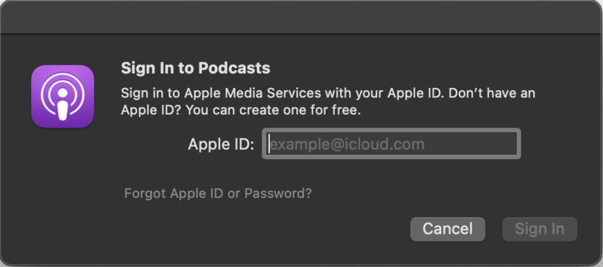
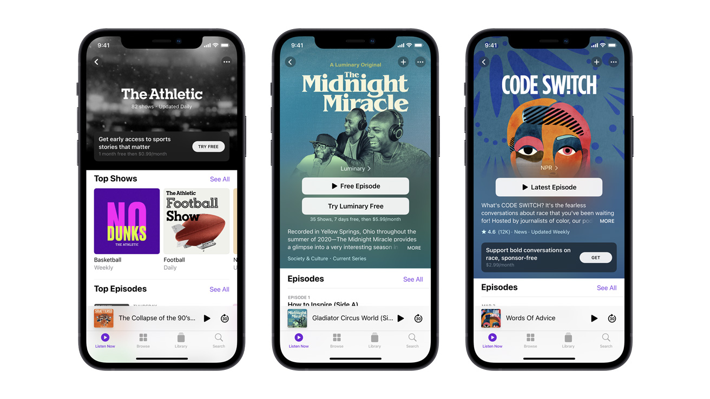
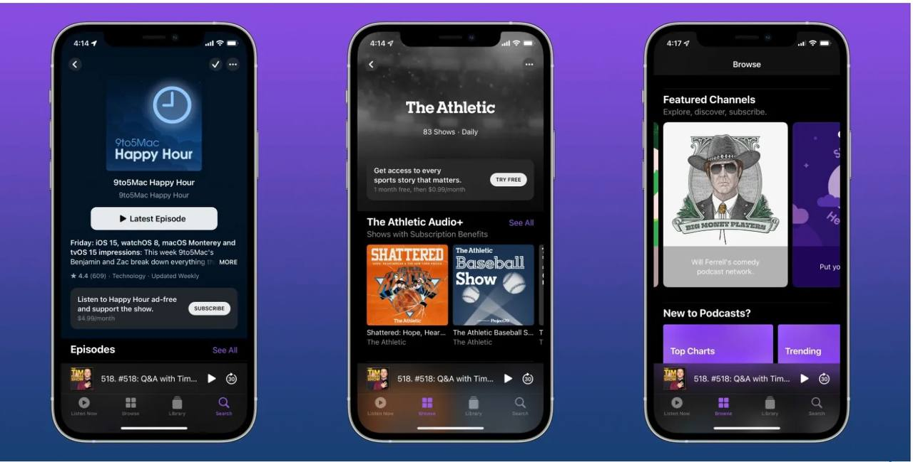
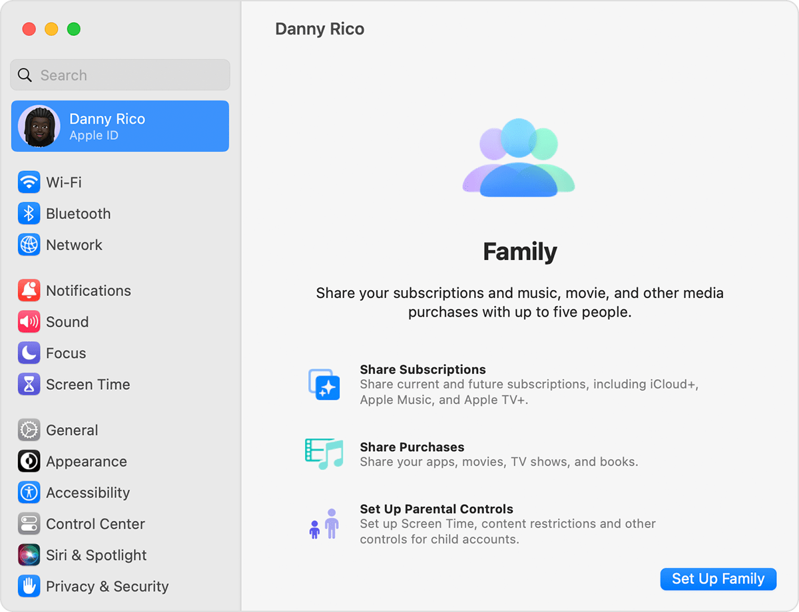

# Commence using **Apple Podcasts**

**Apple Podcasts** (known as simply Podcasts in Apple operating systems) is an audio streaming service and media player application developed by Apple Inc. for playing podcasts. Apple began supporting podcasts with iTunes 4.9 released in June 2005 and launched its first standalone mobile app in 2012. **Apple Podcasts** is the best app for finding, following, and listening to millions of the world’s most popular podcasts. You can easily discover new shows through expert curation and personalized recommendations.
## Requirements

The necessary prerequisites for downloading and utilizing :
+ Apple Podcasts is available on iOS, iPadOS, macOS, watchOS, tvOS, CarPlayand on Amazon Alexa devices.
+ It is essential to have a Wi-Fi connection for utilizing Apple Podcasts.
+ To use all of the features with Apple Podcasts on Alexa, make sure that you update to the latest version of iOS or iPadOS. You should also check the App Store or the Google Play Store to see if there are updates to the Amazon Alexa app.

## Step 1 : Downloading an app
Apple Podcasts are typically pre-installed on Apple devices. But if you accidentally deleted it, the program can easily be downloaded from Appstore. Just follow this link [Apple Podcasts app](https://apps.apple.com/ua/app/%D0%BF%D0%BE%D0%B4%D0%BA%D0%B0%D1%81%D1%82%D0%B8/id525463029?l=uk).

## Step 2 : Registration on Apple Podcasts

1. In the Podcasts app on your apple device, choose Account => Sign In.
2. Follow the on-screen instructions to enter your Apple ID and password, then click Sign In. 

> You can change your Apple ID name, password, or billing information at any time. You can also change the country or region.
> 1. In the Podcasts app on your Mac, choose Account > View Apple ID to open the Media & Purchases options.
> 2. Next to your account, click Manage. (You will need to log in).
> 3. Do any of the following actions :
>+ Change your Apple ID name or password. Click Edit at "appleid.apple.com".
>+ Change your payment information. Click Manage Payments.
>+ Change your billing address. Click Edit.
>+ Change the country or region code. Click Change country or region.
## Step 3 : Search and listen to podcasts
1. In the Podcasts app on your device, click in the search box, then do one of the following:
+ To choose from the available categories, select a topic, such as Comedy or Sports.
+ To search all podcasts, enter a search term in the search box, then select one of the search results. Click "All Podcasts" on the right.
+ To search the media library, enter a search term in the search field, then select one of the search results. Click "Your media library".
2. In the search results, do one of the following actions:
+ To play a show or episode, hover over the show or episode and click the Play button. See Listening to Podcasts.
+ To view show or episode details, under Shows, click the title link under the show. In the Episodes section, click the title link next to the episode.
+ To view channel details click a channel. (Subscription may be required for full access.)
+ To subscribe to a show or channel, select a show or channel, then click a subscription offer from the podcast creator. 
## Step 4: How to subscribe to a show or channel
1. In the Podcasts app on your device, select the show or channel you want to subscribe to.When you subscribe to a show, you'll automatically follow it. See the show tracking section for details.
2. Click the subscribe button. You may need to enter your Apple ID and password. 
3. To confirm your subscription, select an available subscription offer from the podcast author (for example, annual or monthly).
> You can view and change subscriptions purchased in the Podcasts app, the App Store, the Apple TV app, the iTunes Store, or Apple News.
>1. In the Podcasts app on your device, choose Account > View Apple ID. The Media and Purchases options will open.
>2. Click Manage next to Subscriptions.
>3. Click Edit next to the subscription, then do one of the following:
>+ To change your subscription options, select an option from the Options list and click Done.
>+ To unsubscribe, click Unsubscribe, confirm the cancellation, and click Done. 

> **Share subscriptions in Apple Podcasts**
> + When you subscribe to shows or channels, you can use Family Sharing to share your subscriptions among up to five family members.
>+ If you join a family group and a member of the family group subscribes to a show or channel you're already subscribed to, your subscription won't renew in the next billing cycle and you'll use the group subscription instead. If you join a family group that doesn't have a subscription, the group will use your subscription.

## Support
If you encounter any issues with this app, please visit our support site for assistance. Our dedicated support team is available to help resolve any problems you may be facing. Simply navigate to [support](https://support.apple.com/apps) for step-by-step troubleshooting guides and direct contact options.
