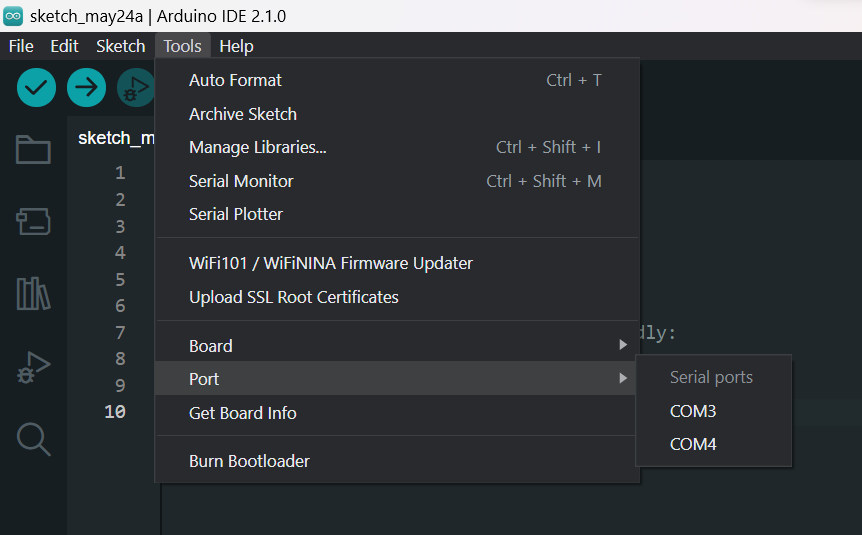
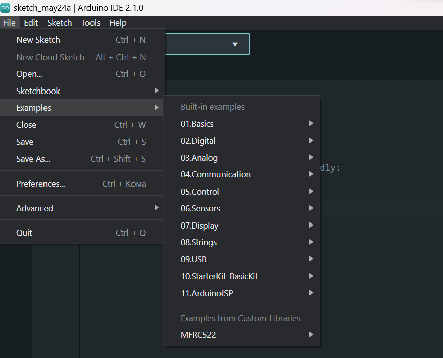

# Arduino - Get Started Guide

This document will provide you with the initial instructions for using Arduino and getting started with the platform.

Read an [introduction](https://www.arduino.cc/en/Guide/Introduction) on what is Arduino and why you'd want to use it.

## Requirements

Before getting started, you will need:

- An Arduino board
- A computer with Arduino IDE installed
- A USB cable to connect Arduino to the computer

## Step 1: Installing Arduino IDE

1. Visit the official Arduino website at [arduino.cc/software](https://www.arduino.cc/en/software).
2. Download the Arduino IDE from the "Downloads" page.
3. Install the Arduino IDE on your computer by following the [instructions](https://docs.arduino.cc/software/ide-v2/tutorials/getting-started/ide-v2-downloading-and-installing) for your operating system.

## Step 2: Connecting Arduino

1. Launch the Arduino IDE.
2. Connect Arduino to your computer using the USB cable.

## Step 3: Selecting the Board and Port

1. In the `Menu Bar` select `Tools` > `Board` > `Arduino AVR Boards` select the appropriate board.

2. In the `Menu Bar` select `Tools` > `Port`  choose the correct port for your Arduino board. If you're unsure which port to select, refer to the documentation specific to your board.

>You can find more information about board on [arduino/boards](https://www.arduino.cc/en/hardware#boards)
>
>If your board does not appear on a port in Arduino IDE: [arduino/support](https://support.arduino.cc/hc/en-us/articles/4412955149586-If-your-board-does-not-appear-on-a-port-in-Arduino-IDE)

## Step 4: First Project

### You can use already existing code examples

1. To view available code examples, select `File` > `Examples` to browse through the available code examples.

2. Choose one of the examples to open it in the new Arduino IDE window.
3. Familiarize yourself with the code and the accompanying comments that explain different parts of the program.

### Or write your own code

1. This documentation will help you write your first code: [Bare Minimum code needed](https://docs.arduino.cc/built-in-examples/basics/BareMinimum)

After writing the code, click the `Upload` button to upload it to the Arduino board.

### **Congratulations!** You have completed your first Arduino code. **Have fun exploring and creating with Arduino!**

## Additional Resources

- Advice on what to do if things don't work: [Troublechooting](https://www.arduino.cc/en/Guide/Troubleshooting)
- Official Arduino Documentation: [Arduino Documentation](https://docs.arduino.cc/?_gl=1*gks2yv*_ga*NzI5NDYyOTU0LjE2ODQ3Njg0OTE.*_ga_NEXN8H46L5*MTY4NDkyNzA1MS4zLjEuMTY4NDkzMTU3Ny4wLjAuMA..)
- Arduino Forum: [Forum](https://forum.arduino.cc/)
- Arduino Community on Reddit: [Reddit.com/arduino](https://www.reddit.com/r/arduino/)
