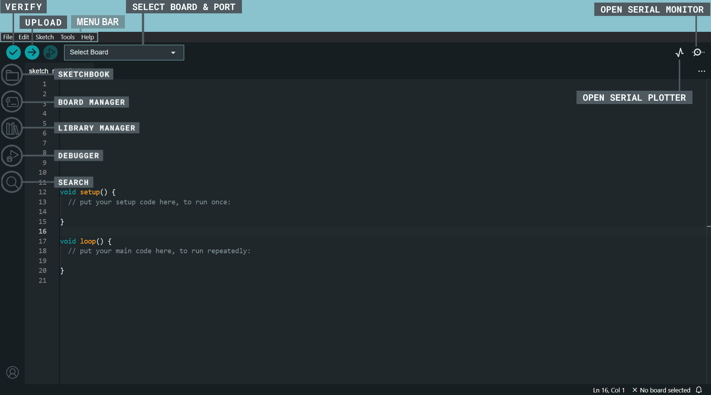

# Arduino - get started guide

This document will provide you with the initial instructions for using Arduino and getting started with the platform.

Read an [introduction](https://www.arduino.cc/en/Guide/Introduction) on what Arduino is and why you'd want to use it.

## Requirements

Before getting started, you will need:

- An Arduino board
- A computer with Arduino IDE installed
- A USB cable to connect Arduino to the computer

## Step 1: Installing Arduino IDE

1. Visit the official Arduino website at [arduino.cc/software](https://www.arduino.cc/en/software).
2. Download the Arduino IDE from the "Downloads" page.
3. Install the Arduino IDE on your computer by following the [instructions](https://docs.arduino.cc/software/ide-v2/tutorials/getting-started/ide-v2-downloading-and-installing) for your operating system.

## Arduino IDE user interface overview

- Verify / Upload - compile and upload your code to your Arduino Board.
- Select Board & Port - detected Arduino boards automatically show up here, along with the port number.
- Sketchbook - here you will find all of your sketches locally stored on your computer. Additionally, you can sync with the Arduino Cloud, and also obtain your sketches from the online environment.
- Boards Manager - browse through Arduino & third party packages that can be installed. For example, using a MKR WiFi 1010 board requires the Arduino SAMD Boards package installed.
- Library Manager - browse through thousands of Arduino libraries, made by Arduino & its community.
- Debugger - test and debug programs in real time.
- Search - search for keywords in your code.
- Open Serial Monitor - opens the Serial Monitor tool, as a new tab in the console.

## Step 2: Connecting Arduino

1. Launch the Arduino IDE.
2. Connect Arduino to your computer using the USB cable.

## Step 3: Selecting the board and port

1. In the `menu bar`, select `Tools` > `Board` > `Arduino AVR Boards`.
2. Select the appropriate board.
3. In the `menu bar`, select `Tools` > `Port`.
4. Choose the correct port for your Arduino board. If you're unsure which port to select, refer to the documentation specific to your board.

>You can find more information about the board on [arduino/boards](https://www.arduino.cc/en/hardware#boards)
>
>If your board does not appear on a port in Arduino IDE: [arduino/support](https://support.arduino.cc/hc/en-us/articles/4412955149586-If-your-board-does-not-appear-on-a-port-in-Arduino-IDE)

## Step 4: First project

### You can use already existing code examples

1. To view available code examples, select `File` > `Examples`.
2. Choose one of the examples to open it in the new Arduino IDE window.
3. Familiarize yourself with the code and the accompanying comments that explain different parts of the program.
4. 

     Click the &nbsp;<code>Upload</code>&nbsp; &nbsp;button to upload it to the Arduino board.
    

### Or write your own code

If you have never written code for Arduino before, this [documentation](https://docs.arduino.cc/built-in-examples/basics/BareMinimum) may help you.

When you launch the Arduino IDE, it opens with a default draft sketch that you can edit right away. Alternatively, you can create a new sketch and write your code there:

1. Click New Sketch in the lower left of the window.
2. In the new sketch window that opens, write your code.
3. 

     When your code is ready, click the &nbsp;<code>Upload</code>&nbsp; &nbsp;button to upload it to the Arduino board.
    

**Congratulations! You have completed your first Arduino code. Have fun exploring and creating with Arduino!**

## Additional Resources

- Advice on what to do if things don't work: [Troubleshooting](https://www.arduino.cc/en/Guide/Troubleshooting)
- Official Arduino Documentation: [Arduino Documentation](https://docs.arduino.cc/?_gl=1*gks2yv*_ga*NzI5NDYyOTU0LjE2ODQ3Njg0OTE.*_ga_NEXN8H46L5*MTY4NDkyNzA1MS4zLjEuMTY4NDkzMTU3Ny4wLjAuMA..)
- Arduino Forum: [Forum](https://forum.arduino.cc/)
- Arduino Community on Reddit: [Reddit.com/arduino](https://www.reddit.com/r/arduino/)
