# **Bolt - ride-hailing and transportation application**

 

### Welcome to the Bolt documentation! This guide will provide you with the necessary information to get started with Bolt, a ride-hailing and transportation application. Whether you're a driver or a passenger, Bolt is designed to provide a seamless and efficient experience for all users.
 

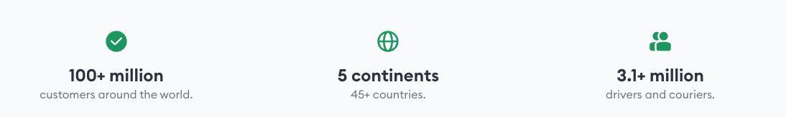

 
 

> ## **Table of contents**
> 
 

1. **Introduction to Bolt**
   * What is Bolt?
   * Key Features
   * Benefits
2. **Getting started**
   * Installation
   * Creating an Account
3. **Using Bolt as a passenger**
   * Requesting a ride
   * Choosing a vehicle
   * Tracking your ride
4. **Using Bolt as a driver**
   * Becoming a driver
   * Accepting ride requests
   * Navigating to the passenger
5. **Payment and ratings**
   * Payment options
   * Rating and feedback
6. **Safety and security**
   * Safety measures
   * Emergency support
7. **Contact and support**
   * Customer support
   * Feedback and suggestions
  
 

> ## **1. Introduction to Bolt**
 

### **What is Bolt?**
Bolt is a ride-hailing and transportation application that connects passengers with drivers in a convenient and efficient manner. Whether you need a quick ride to your destination or want to earn money by driving, Bolt provides a user-friendly platform to facilitate the entire process.

### **Key Features**
* Easy booking: Bolt allows passengers to request rides with a few simple taps on their smartphones, providing a hassle-free booking experience.
* Affordable pricing: Bolt offers competitive and transparent pricing, ensuring that passengers get value for their money.
* Fast and reliable service: Bolt connects passengers with nearby drivers, minimizing wait times and providing reliable transportation.
* Driver selection: Passengers can choose from a variety of vehicle options based on their preferences and requirements.
* Safety and security: Bolt prioritizes the safety of both passengers and drivers, implementing safety measures and providing emergency support.

### **Benefits**
* Convenience: Bolt eliminates the need for hailing taxis on the street or waiting at designated stands, allowing passengers to book rides from anywhere at any time.
* Cost-effective: Bolt's pricing structure ensures that passengers receive fair and affordable transportation services.
* Income opportunity: Bolt provides an opportunity for individuals to become drivers and earn money by leveraging their own vehicles.
* Reliable service: Bolt's focus on driver availability and efficient routing ensures that passengers can rely on the platform for their transportation needs.
* Seamless experience: Bolt's user-friendly interface and intuitive features make it easy for both passengers and drivers to use the application.
  
 

> ## **2. Getting started**
 

* ### **Installation**
To begin using Bolt, follow these steps to install the application on your mobile device:

1. Open the app distribution platform on your device.
   
   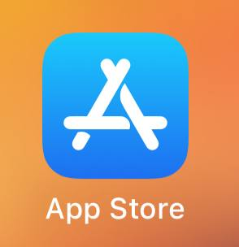

2. Search for "Bolt" or "Taksi App" in the search bar.

   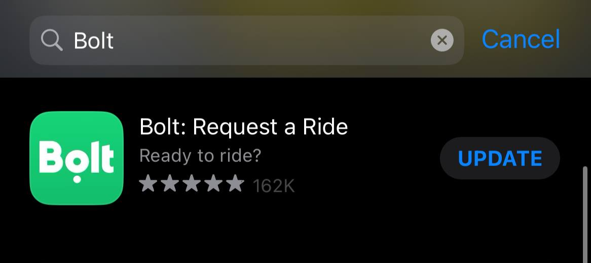

3. Locate the Bolt app from the search results and tap on it.
   
   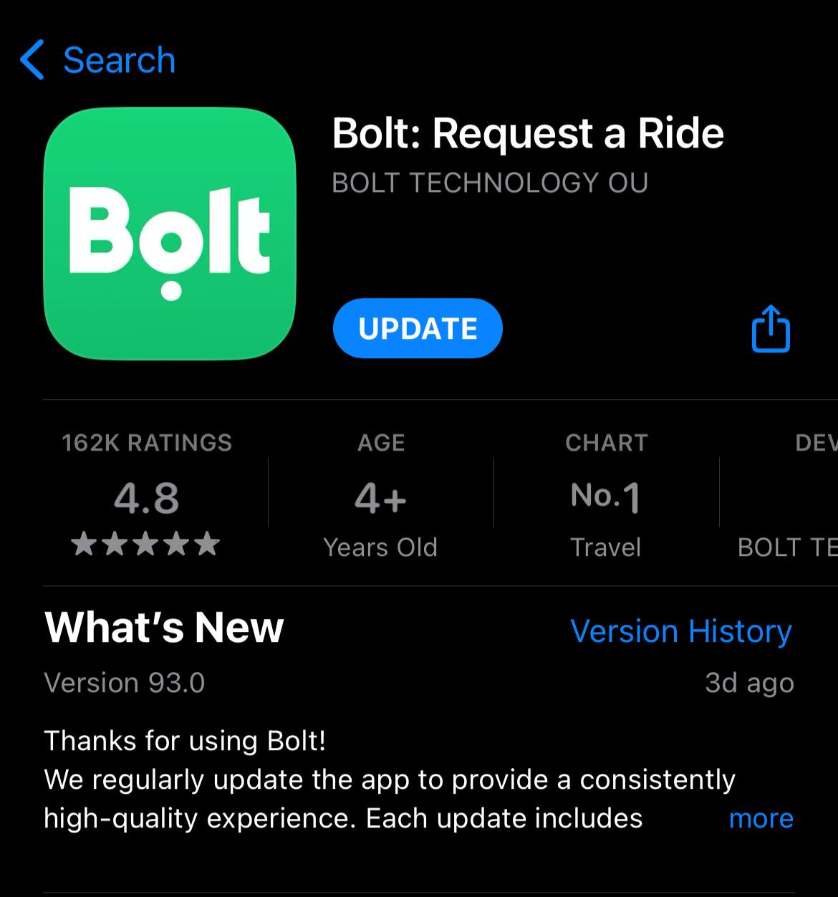

4. Tap the "Install" or "Get" button to download and install the app.
5. Once the installation is complete, locate the Bolt app on your device's home screen and tap on it to launch the app.
   
   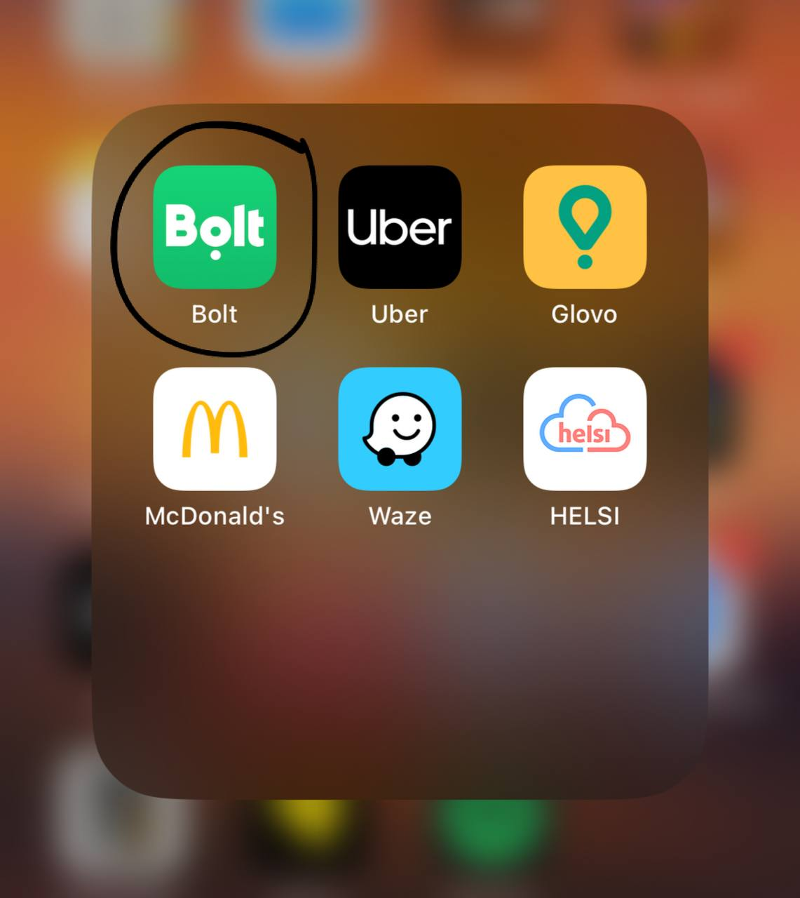

 

* ### **Creating an account**

To use Bolt as a passenger or driver, you'll need to create an account. Follow these steps to create your account:

1. Launch the Bolt app on your mobile device.
   
   

2. On the welcome screen, tap on the **Sign up** or **Create account** button.
   
   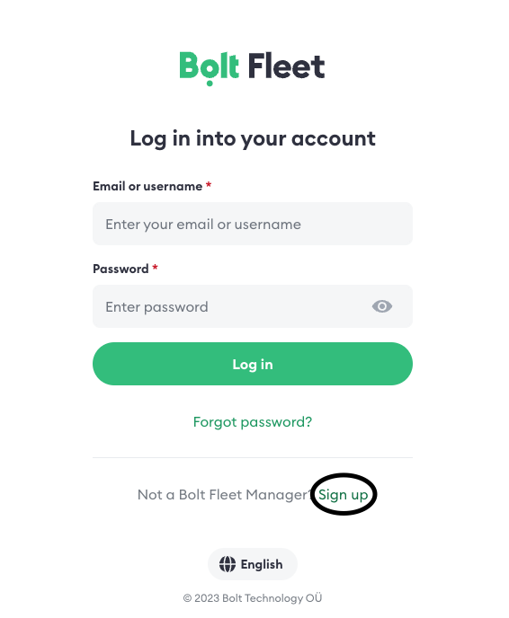

3. Provide the required information, such as your name, email address, phone number, and create a password.
   
   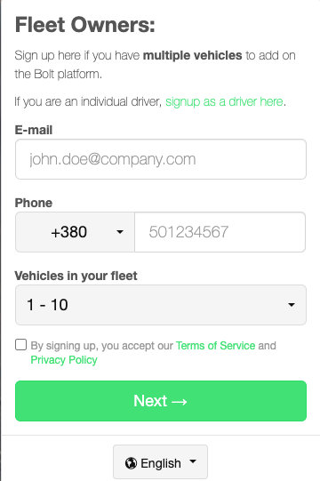

4. Read and accept the terms of service and privacy policy, if prompted.
5. Verify your phone number through a verification code sent via SMS or email.
   
   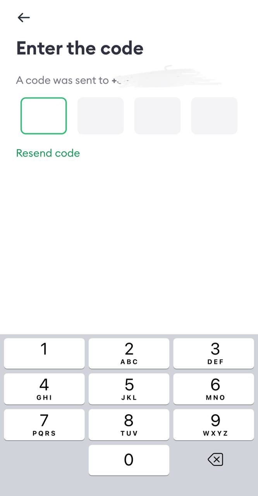

6. Once your account is created and verified, you can log in to the Bolt app using your credentials.
   
 

> ## **3. Using Bolt as a passenger**
 
As a passenger, you can use Bolt to request rides and conveniently reach your desired destinations. Follow the steps below to get started:

* ### **Requesting a ride**
  1. Open the Bolt app on your mobile device and log in to your account.
   
    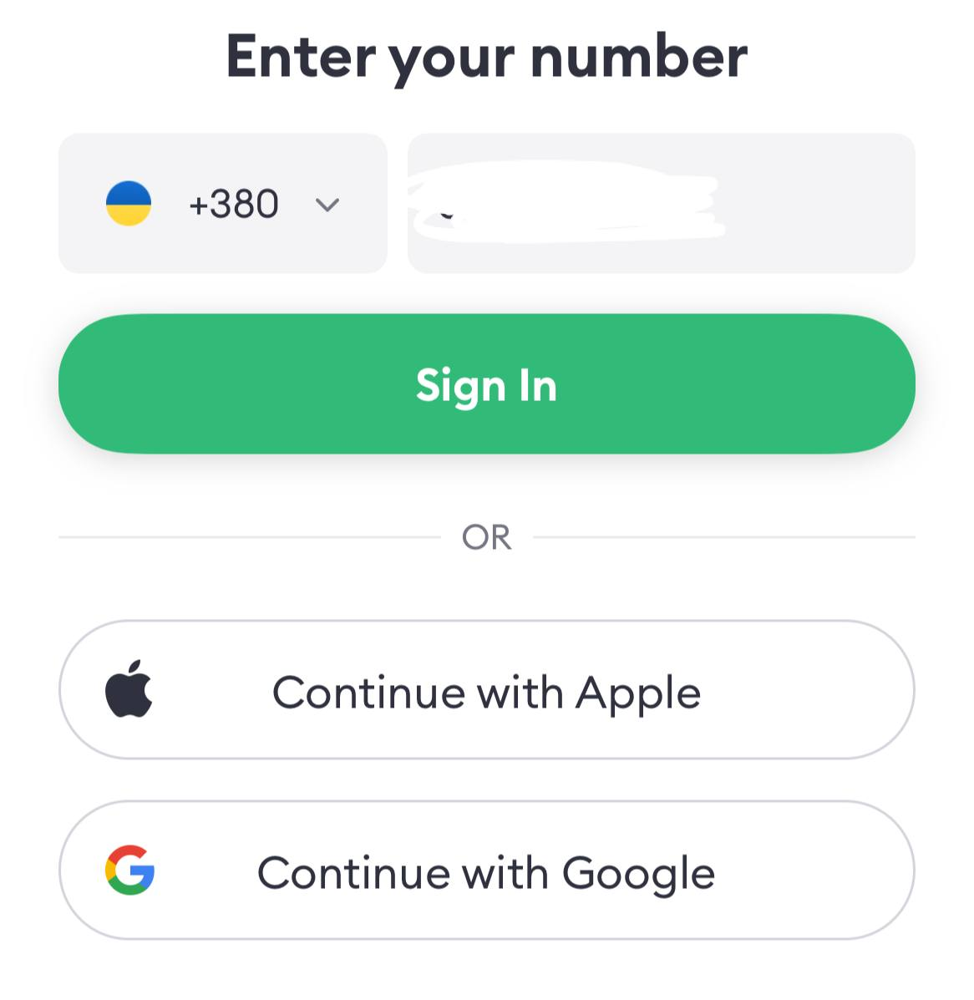

  2. Ensure that your current location is correctly displayed on the map. If not, you can manually enter your pickup location.
   
   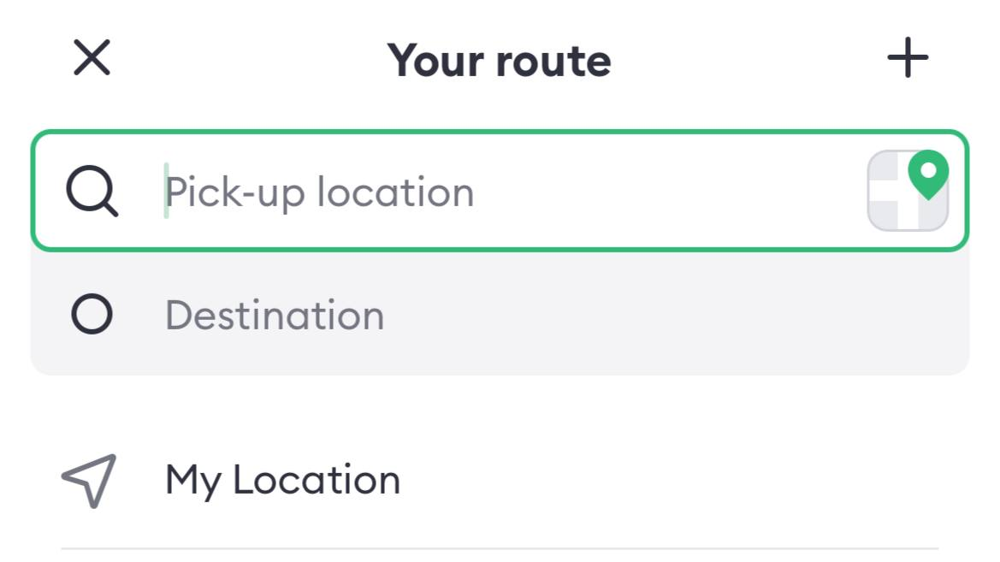

  3. Enter your destination in the designated field. You can either type the address or choose from a list of suggested locations.
  4. Review the available vehicle options, such as Standard, Comfort, or XL, and select the one that suits your needs.
   
   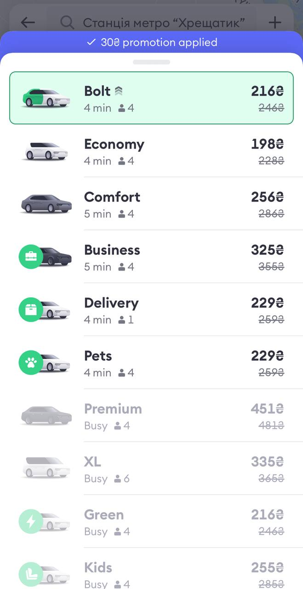

  5. Once you've selected your preferred vehicle option, tap the **Request Order** button.
   
   

 

* ### **Choosing a vehicle**

1. After requesting a ride, you'll be shown the available drivers nearby.
   
   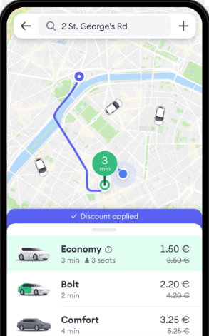

2. The app will display the estimated time of arrival (ETA) for each driver.
3. You can view the driver's profile, rating, and vehicle details to make an informed choice.
4. Select the driver you prefer by tapping on their profile.
   
 

* ### **Tracking your ride**

1. Once you've selected a driver, you'll be able to track their location and ETA on the map.
2. The app will provide real-time updates on the driver's progress towards your pickup location.
3. You can also contact the driver through the app's messaging or calling features if necessary.
4. Once the driver arrives, you'll receive a notification, and their vehicle details will be displayed.

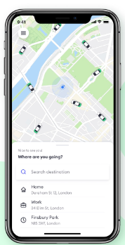

 

> ## **4. Using Bolt as a driver**
 

* ### **Becoming a Driver**

1. Open the Bolt app on your mobile device and log in to your account.
2. Navigate to the driver section or look for an option to join as a driver.
3. Complete the driver registration process, which may include providing personal information, vehicle details, and necessary documentation (such as a valid driver's license and insurance).
4. Consent to any required background checks or screenings as part of the registration process.

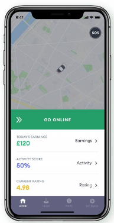

* ### **Accepting ride requests**

1. Once you've completed the driver registration process, make sure you have the Bolt app open and are logged in.
2. You'll receive ride requests from passengers in your vicinity when you're online and available to drive.
3. You can accept or decline ride requests based on your availability and location.
   
   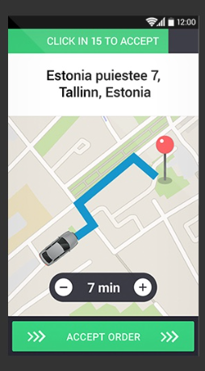

4. When a ride request comes in, review the passenger's pickup location and accept the request if you're able to provide the ride.

* ## **Navigating to the passenger**

1. After accepting a ride request, the Bolt app will provide navigation instructions to reach the passenger's pickup location.
2. Follow the navigation instructions to efficiently navigate to the designated location.
3. If needed, you can contact the passenger through the app's messaging or calling features for additional communication.

 

> ## **5. Payment and ratings**
 

* ## **Payment options**
1. As a passenger, you can link your preferred payment method to your Bolt account. Accepted payment methods may include credit cards, debit cards, or mobile payment options.
2. Before confirming your ride, ensure that your selected payment method is valid and up to date.
3. After completing a ride, the fare will be automatically charged to your linked payment method.
4. Bolt provides transparent pricing, and you'll receive a digital receipt for each transaction.

* ## **Rating and feedback**
1. After completing a ride, passengers have the option to rate their experience and provide feedback on the driver.
2. The rating system typically ranges from 1 to 5 stars, with 5 stars representing an excellent experience.
3. You can also provide specific comments or suggestions to help Bolt improve its services.
4. Drivers with consistently high ratings and positive feedback are more likely to receive ride requests.
   
   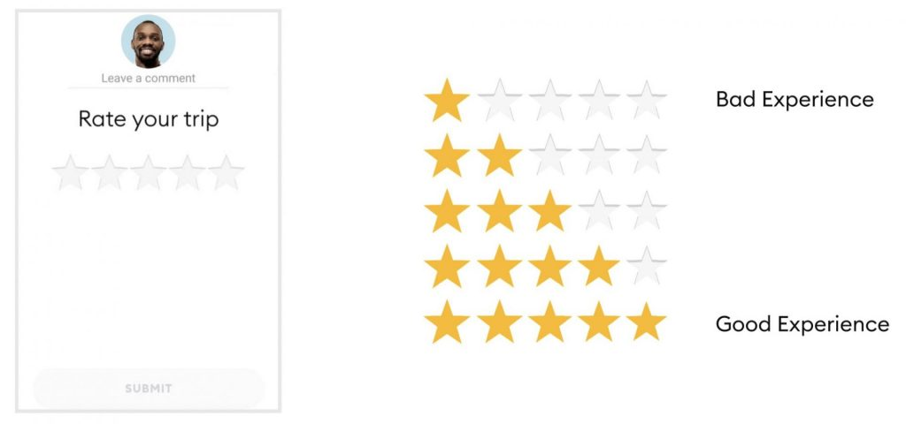

 

> ## **6. Safety and security**
 

* ## **Safety measures**
1. Driver Screening: Bolt conducts background checks and driver screenings to verify the identities and driving records of drivers before they are approved to drive on the platform.
2. Vehicle Inspection: Bolt may require drivers to ensure their vehicles meet specific safety standards and pass regular inspections.
3. GPS Tracking: the Bolt app includes real-time GPS tracking, allowing passengers to share their location with friends and family during a ride.
4. In-App Emergency Button: Bolt provides an emergency button within the app, allowing passengers to quickly contact emergency services if needed.

* ## **Emergency support**
1. In case of an emergency during a ride, passengers can use the in-app emergency button to contact local emergency services.
2. Bolt maintains customer support channels to address any safety concerns or emergencies reported by passengers or drivers.
3. Passengers and drivers are encouraged to report any safety incidents or concerns through the app's support system.

 

> ## **7. Contact and support**
 

* ## **Customer support**
1. Open the Bolt app on your mobile device and log in to your account.
2. Navigate to the support or help section, usually accessible through the app's menu or settings.
   
   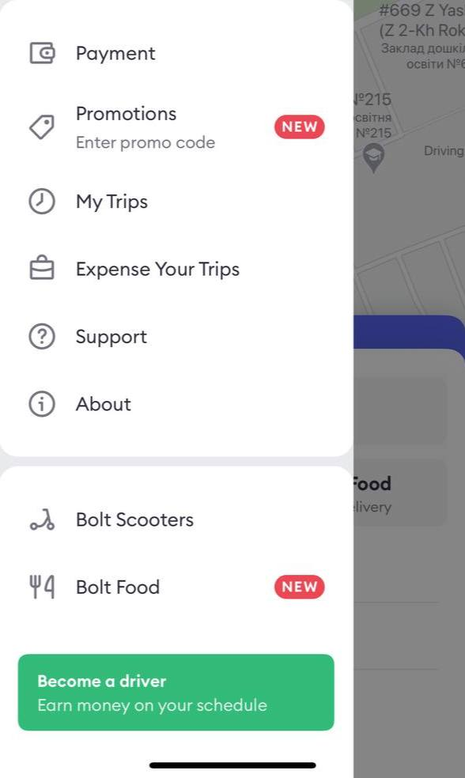

3. Here, you'll find FAQs, guides, and troubleshooting information that can help address common issues.
   
   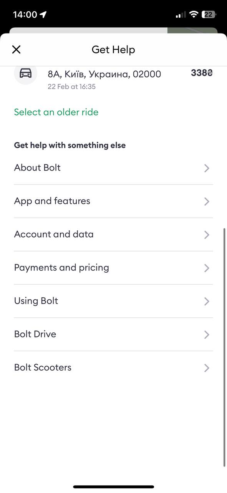

4. If you need further assistance, you can submit a support ticket or contact customer support through the provided channels, such as email or in-app chat.

* ## **Feedback and Suggestions**
1. Bolt welcomes feedback and suggestions to improve its services.
2. You can provide feedback directly through the Bolt app by accessing the feedback or suggestions section.
3. Alternatively, you may also find feedback options on the Bolt website or social media channels.

 
 

*Congratulations! You now have a comprehensive overview of using Bolt, from installation to managing your account and accessing customer support. Enjoy your rides with Bolt and have a great experience!*