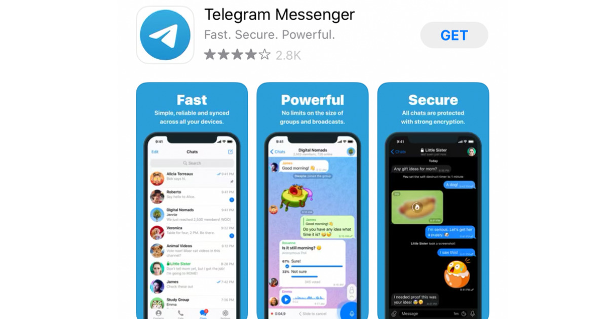
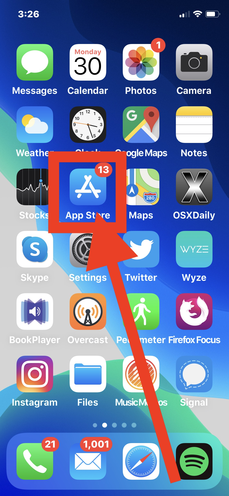

# **Telegram - Messaging and Communication App**

 

### Welcome to the Telegram documentation! This guide will provide you with the necessary information to get started with Telegram, a messaging and communication app. Whether you're looking to chat with friends, join communities, or share media, Telegram offers a feature-rich and secure platform for all your communication needs.

 

 
 

> ## **Table of Contents**
> 
 

1. **Introduction to Telegram**
   * What is Telegram?
   * Key Features
   * Benefits
2. **Getting Started**
   * Installation
   * Creating an Account
   * Finding Contacts
3. **Messaging and Chats**
   * Sending Messages
   * Group Chats
   * Media Sharing
4. **Channel and Community**
   * Creating a Channel
   * Joining Communities
   * Managing Notifications
5. **Security and Privacy**
   * End-to-End Encryption
   * Secret Chats
   * Two-Step Verification
6. **Customization and Settings**
   * Theme and Appearance
   * Notification Settings
   * Privacy Settings
7. **Contact and Support**
   * Help Center
   * Reporting Issues
   * Feedback and Suggestions

 

> ## **1. Introduction to Telegram**
 

### **What is Telegram?**
Telegram is a messaging and communication app that allows users to send text messages, make voice and video calls, and share media files. It provides a cloud-based platform that enables seamless synchronization across multiple devices, ensuring you can access your messages from anywhere.

### **Key Features**
* Secure messaging: Telegram offers end-to-end encryption for private and secure communication.
* Cloud storage: All your messages, media, and files are securely stored in the Telegram cloud, allowing you to access them from any device.
* Group chats and communities: Create or join groups and communities to chat with multiple users and share interests.
* Media sharing: Share photos, videos, documents, and other files of various formats easily.
* Voice and video calls: Make high-quality voice and video calls to your contacts.
* Customization: Customize the app's appearance with themes, wallpapers, and stickers.

### **Benefits**
* Privacy-focused: Telegram prioritizes user privacy by offering end-to-end encryption and optional secret chats.
* Cross-platform availability: Telegram is available on various platforms, including mobile, web, and desktop, ensuring you can stay connected wherever you are.
* Large group capacity: Telegram supports large group chats, making it suitable for communities, teams, and events.
* Cloud storage convenience: With cloud storage, you don't have to worry about losing your messages or media when switching devices.
* Rich media sharing: Easily share photos, videos, documents, and other files with your contacts or groups.

 

> ## **2. Getting Started**
 

* ### **Installation**
To begin using Telegram, follow these steps to install the app on your device:

1. Visit the app store on your mobile device.

   

2. Search for "Telegram" in the search bar.

   

3. Locate the Telegram app from the search results and tap on it.

   

4. Tap the "Install" or "Get" button to download and install the app.
5. Once the installation is complete, locate the Telegram app on your device's home screen or app drawer and tap on it to launch the app.

* ### **Creating an Account**
After launching the Telegram app, follow these steps to create a new account:

1. Open the Telegram app on your device.
2. On the welcome screen, tap on "Start Messaging" or "Create Account."
3. Enter your phone number. Telegram will send you a verification code via SMS.
4. Once you receive the verification code, enter it in the app.
5. Set a profile name and an optional profile picture for your account.
6. You have successfully created your Telegram account. You can now start using the app.

* ### **Finding Contacts**
To start messaging your contacts on Telegram, you have a few options:

1. **Sync Contacts**: Telegram can automatically sync your device's contacts to find friends who are already using Telegram. To do this, follow the prompts when setting up your account, or go to the app's settings and look for the "Contacts" or "Find Friends" option.

2. **Search by Username**: If you know someone's Telegram username, you can search for them directly. Tap on the search icon (usually represented by a magnifying glass) within the app and enter the username in the search bar. Tap on the user's profile to start a chat.

3. **Invite Friends**: You can invite your friends to join Telegram by sending them an invitation link. Open a chat, tap on the contact's name or profile picture to access their profile, and look for the "Invite to Telegram" option. You can send the invitation link via other messaging apps or through other communication channels.

Remember, both you and your contacts need to have Telegram installed and be connected to the internet to exchange messages.

 

> ## **3. Messaging and Chats**
 

* ### **Sending Messages**
Once you have found and added contacts on Telegram, you can start sending messages:

1. Open the Telegram app on your device.
2. Tap on the "Chats" tab at the bottom of the screen.
3. Select a contact or group from your chat list, or tap on the pencil icon to start a new chat.
4. Type your message in the text input field at the bottom of the screen.
5. Tap the send icon (usually represented by a paper plane) to send the message.

You can also enhance your messages with additional features:

* **Emojis and Stickers**: Tap on the smiley face icon to access a selection of emojis and stickers. Choose the one you want to use and send it with your message.

* **Attachments**: Tap on the attachment icon (usually represented by a paperclip) to share photos, videos, documents, and other files from your device or cloud storage.

* **Voice Messages**: Hold down the microphone icon and start recording your voice message. Release the icon to send the message.

* **Replying and Forwarding**: Tap and hold on a message to reveal options for replying to or forwarding the message to another chat.

* ### **Group Chats**
Telegram allows you to create and participate in group chats with multiple users. Here's how to use group chats:

1. Open the Telegram app on your device.
2. Tap on the "Chats" tab at the bottom of the screen.
3. Tap the pencil icon to start a new chat.
4. Select multiple contacts or search for contacts to add to the group.
5. Once you've added the desired contacts, tap the checkmark or "Create" button to create the group.
6. You can now send messages, media, and other content to the group, and all members of the group will be able to see and participate in the conversation.

Group chats offer additional features such as member management and admin controls. Here are some additional features and actions you can take in a group chat:

* **Group Info**: Tap on the group name or profile picture to access the group info screen. Here, you can view and edit group details, such as the group name, photo, description, and member list.

* **Adding Members**: As a group admin, you can add new members to the group. In the group chat, tap on the group name or profile picture, select "Add Members," and choose the contacts you want to add. You can also invite people using an invite link.

* **Removing Members**: Group admins can remove members from the group. Go to the group info screen, tap on a member's name, and select "Remove from Group." Confirm the action to remove the member.

* **Promoting Members**: Admins can promote other group members to become admins. In the group info screen, tap on a member's name, select "Make Admin," and confirm the action. Admins have additional privileges, such as managing members and editing group settings.

* **Muting Notifications**: If you want to temporarily silence group notifications, you can mute the group chat. Open the group chat, tap on the group name or profile picture, and select "Mute." Choose the desired duration for muting notifications.

* **Pin Messages**: Group admins can pin important messages to the top of the chat for easy access. Tap and hold on a message, then select "Pin" from the options. Pinned messages will be visible to all members.

* **Creating Polls**: In group chats, you can create polls to gather opinions or make group decisions. Tap on the attachment icon (paperclip) in the chat input field, then select "Poll." Enter the poll question, options, and settings, and send it to the group.

These are just a few of the features available in Telegram group chats. You can explore more options and settings by accessing the group info screen and experimenting with different actions.

 

> ## **4. Additional Features**
 

Telegram offers several additional features and functionalities that enhance your messaging experience. Here are a few notable features:

* **Channels**: Channels in Telegram allow users to broadcast messages to a large audience. Unlike group chats, channels typically have one or more administrators who post messages, and users can subscribe to receive updates. Channels are often used for news, announcements, or community discussions.

* **Voice and Video Calls**: Telegram supports voice and video calls, allowing you to have real-time audio and video conversations with your contacts. To make a call, open a chat with the contact, tap on the phone or camera icon at the top of the screen, and select the desired option.

* **Secret Chats**: Secret Chats are end-to-end encrypted conversations that provide an extra layer of privacy and security. Messages in secret chats can self-destruct, and they are not stored on Telegram's servers. To start a secret chat, go to the chat list, tap on the pencil icon, and select "New Secret Chat."

* **File Sharing and Cloud Storage**: Telegram allows you to share files of various types and sizes. You can send documents, photos, videos, and other files directly within the app. Additionally, Telegram offers cloud storage, where you can store and access files, photos, and videos in your Telegram account.

* **Bots**: Telegram supports chatbots, which are automated programs that can interact with users and provide various services. Bots can be used for tasks such as news delivery, weather updates, language translation, games, and more. You can find and interact with bots by searching for their usernames or accessing bot directories.

* **Customization and Themes**: Telegram provides options to customize your app's appearance. You can change the theme, chat backgrounds, and font size to personalize your Telegram experience. To access these customization options, follow these steps:

1. Open the Telegram app on your device.
2. Tap on the menu icon (usually represented by three horizontal lines) in the top-left corner of the screen to open the side menu.
3. Scroll down and select "Settings."
4. In the Settings menu, you will find various customization options. Here are a few examples:
   * **Theme**: Tap on "Chat Settings" or "Appearance," then select "Theme." Choose between the available light and dark themes or enable the auto theme that adjusts based on your device's settings.
   * **Chat Background**: In the "Chat Settings" or "Appearance" section, you can select "Chat Background" to change the background of your chats. Choose from preloaded backgrounds or use a custom photo from your device's gallery.
   * **Font Size**: Under "Chat Settings" or "Appearance," you can adjust the font size to make text more comfortable to read. Choose from small, medium, large, or extra-large font sizes.
   * **Notification Settings**: Customize how you receive notifications for messages, calls, and other activities. You can adjust sound, vibration, and other notification preferences in the "Notifications and Sounds" section.
   * **Language**: Telegram supports multiple languages. In the Settings menu, tap on "Language" and select your preferred language from the available options.

Feel free to explore the settings menu to discover more customization options and features available in Telegram. The app offers a range of settings to tailor your experience according to your preferences.

 

> ## **5. Privacy and Security**
 

Telegram prioritizes user privacy and security and offers several features to protect your data and conversations. Here are some privacy and security options available in Telegram:

* **End-to-End Encryption**: Secret Chats in Telegram feature end-to-end encryption, meaning only you and the recipient can read the messages. Telegram's server does not have access to the content of these chats. It's important to note that regular chats and group chats do not have end-to-end encryption by default.

* **Two-Step Verification**: Telegram provides an additional layer of security through two-step verification. You can set up a password that will be required when logging in to your Telegram account on a new device. To enable two-step verification, go to the Settings menu, tap on "Privacy and Security," and select "Two-Step Verification."

* **Passcode Lock**: You can add a passcode lock to the Telegram app to prevent unauthorized access. This is different from two-step verification and acts as an app lock. To set up a passcode lock, go to the Settings menu, tap on "Privacy and Security," and select "Passcode Lock."

* **Data Self-Destruction**: In Secret Chats, you can enable self-destructing messages. You can set a timer for how long the messages will be available before they automatically disappear from both devices. To enable self-destruction, open a Secret Chat, tap on the contact's name, and select "Self-Destruct Timer."

* **Blocking and Reporting**: If you encounter unwanted or abusive users on Telegram, you can block them to prevent them from contacting you. Open the chat with the user you want to block, tap on their name or profile picture, and select "Block User." You can also report abusive content or users to Telegram's support team.

Telegram's focus on privacy and security provides users with control over their data and conversations. However, it's essential to remain vigilant and cautious while interacting with others online.

 

> ## **6. Additional Resources**
 

If you need further assistance or want to explore more features and functionalities of Telegram, you can refer to the following resources:

1. **Official Telegram Help Center**: Visit the official Telegram Help Center at [https://telegram.org/support](https://telegram.org/support) for comprehensive guides, FAQs, and troubleshooting information.

2. **Telegram FAQ**: Check out the Telegram FAQ page at [https://telegram.org/faq](https://telegram.org/faq) for answers to commonly asked questions about Telegram's features, privacy, and more.

3. **Telegram Blog**: Stay updated with the latest news, feature releases, and announcements from Telegram by visiting their official blog at [https://telegram.org/blog](https://telegram.org/blog).

4. **Telegram Official Documentation**: For detailed technical information and developer resources, you can refer to the Telegram official documentation at [https://core.telegram.org/](https://core.telegram.org/).

5. **Telegram User Communities**: Join Telegram user communities and groups to connect with other Telegram users, ask questions, and share experiences. You can search for relevant groups or channels within the Telegram app or find Telegram-related communities on social media platforms.

Remember to always prioritize your privacy and security while using any messaging app or online service. Be cautious of sharing sensitive information and exercise discretion when interacting with others.

I hope you find this information helpful! Enjoy using Telegram and connecting with others through the app. If you have any more questions, feel free to ask.
