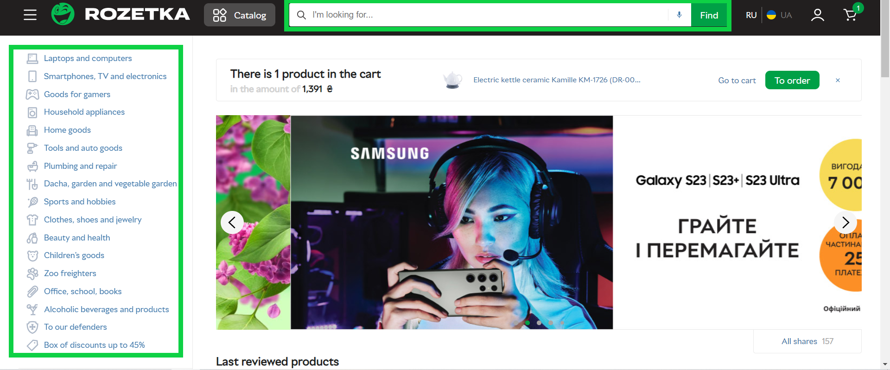
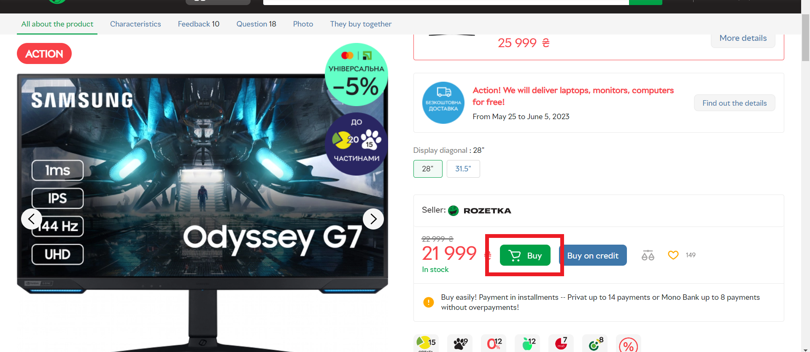
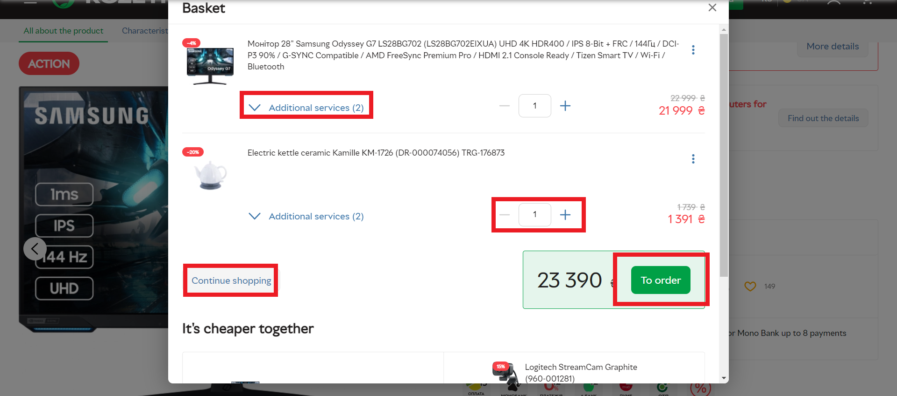
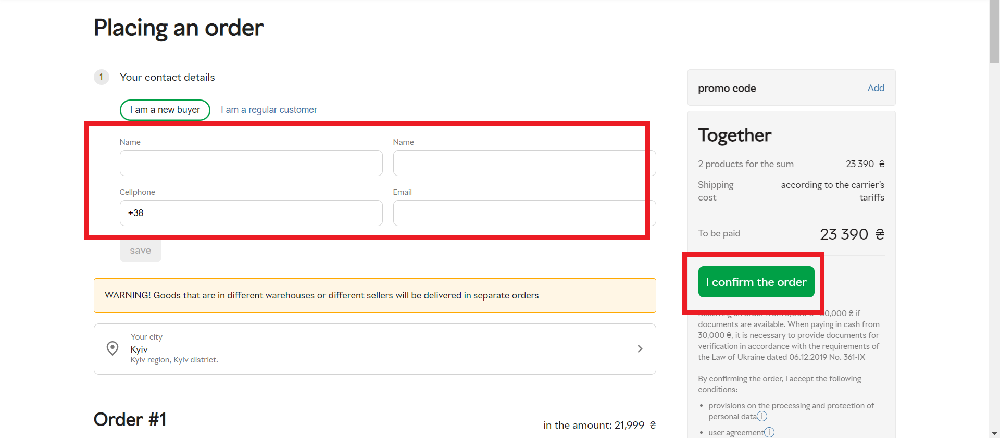
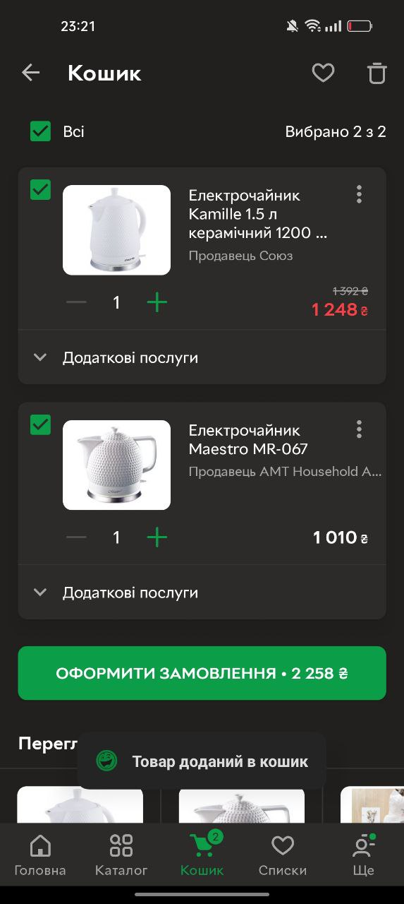
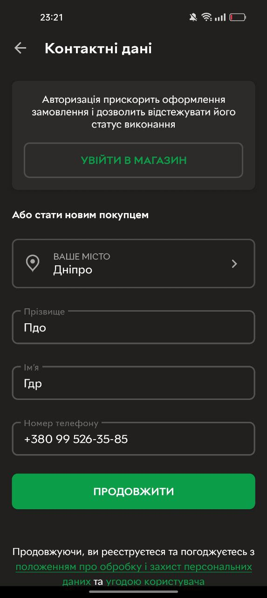
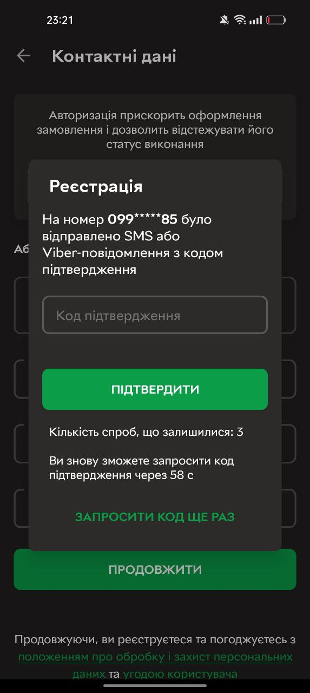

# Start Using **ROZETKA**

**ROZETKA** is an online retailer through which goods of various categories are sold between its users (sellers and buyers). Wide functionality makes **ROZETKA** convenient for the sale and purchase of various goods online store. This document will provide you with the initial instructions for using **ROZETKA**.

## Requirements

Required conditions of use **ROZETKA**: 1) Good internet connection. 2) Access to any web browser.

## Website use

1. Go to the [ROZETKA_website](https://rozetka.com.ua/)

2. Apply filters or/and use search bar to search the desired product.
3. Select a product from proposed list.
4. Read the description of the product, its characteristics. Read the comments of buyers and the responses of the seller of the goods.
5. Сlick the **buy** button to add the item to your cart.

6. In the _cart_ window that opens, select the quantity of goods, the necessary services in the list _Additional services_ then click **Continue buying** buton to find and add other goods or **To Order** to move to **Placing an order**.

7. Select one of “I’m a new buyer” or “I’m a regular customer” modes.
   7.1. If the **“I’m a new buyer”** is selected:
   7.1.1. Enter the information in the next fields: "Name","Surname","Phone number","email". Сlick on the city selection area. in the "Select your city" window that opens, select the city/town from the list of suggested ones or enter it's name in the search bar.
   7.2 if the **“I’m a regular customer”** is selected:
   7.2.1 Enter email or mobile phone number, and password to sign in into your account, or choose **Google** or **Facebook** account to sign in.

8. Scroll down to view your full order (paragraph 1), click **Edit** to change your order if necessary.
9. Select the delivery method and the address (paragraph 2).
10. Select the payment method: _after the goods receiving_,_RozetkaPay_ or _PrivatePay_.
11. In the right side of the screen, click _add_ button near the _Promo code_ field. Enter the promocode, click **Apply**.
12. Click **I confirm the order**.
13. Enter the code that has been sending as an sms-message to your phone number.
14. Click **I confirm the order**. again.

## Mobile app use

1. Go to the [Google_Play](https://play.google.com/store/apps?hl=ru&gl=US) for Android or [App_Store](https://www.apple.com/ua/app-store/) for Apple devices.
2. Make sure to have 27 MB of free space in the memory of an Android devices or 165.2 MB of memory for Apple devices.
3. Click **Install** button to install the app.
4. Open tha app **Rozetka**.

5. Apply filters or/and use search bar to search the desired product.
   5.1 To display information about the product, click on the "Barcode Scanner" button in the right side of the search ba and scan the barcode of the required product.
6. Select a product from proposed list.
7. Read the description of the product, its characteristics. Read the comments of buyers and the responses of the seller of the goods.
8. Multiple ordering options:
   8.1.1 Сlick the **buy now** button to add the item to your cart and going to placing an order process.
   8.2.1 Click at the shopping cart button to add your goods to the order. After, click the button one more time.

8.2.2 Check all of your goods, its amount and cost. Click **Place an order**

9. Fill in the fields _Name_,_Surname_,_Mobile phone number_, choose the city/town, or sign in clicking the **enter the store** button.
10. Enter the code that has been sending as an SMS-message to your phone number.Enter the information from SMS to **Verification code field** Click **Confirm**.

That is all the recomendations. Enjoy your shopping with **ROZETKA**!
