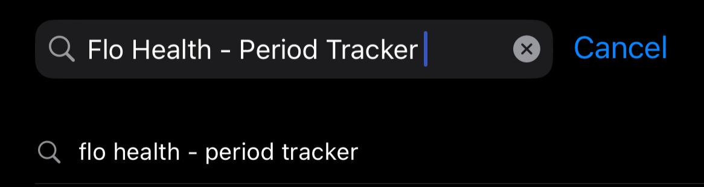
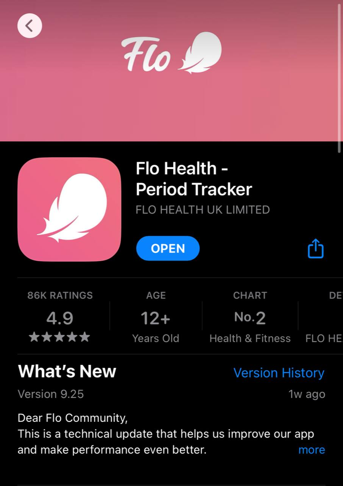
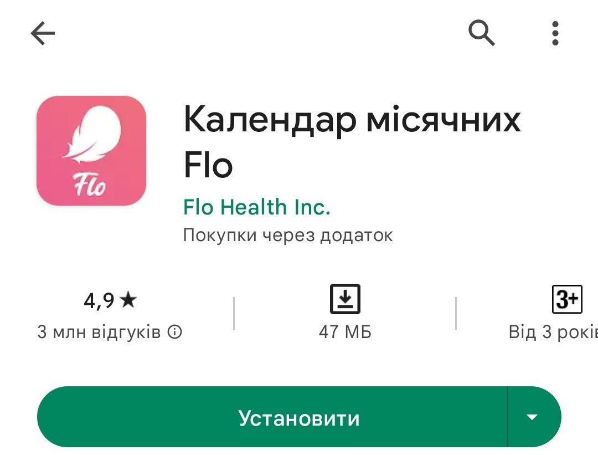
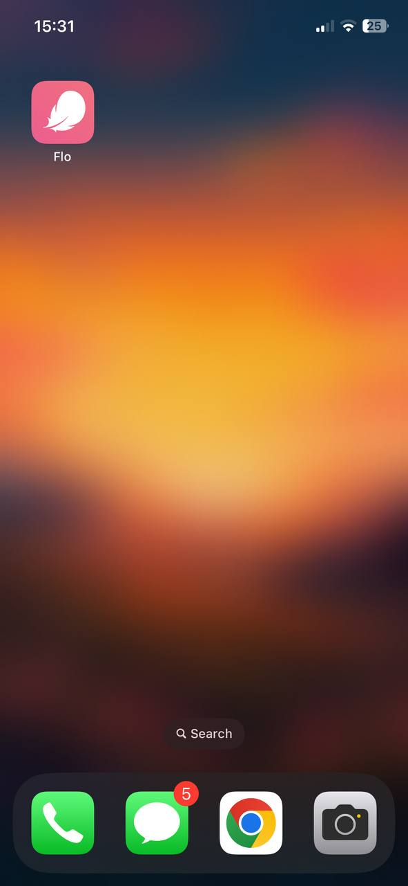
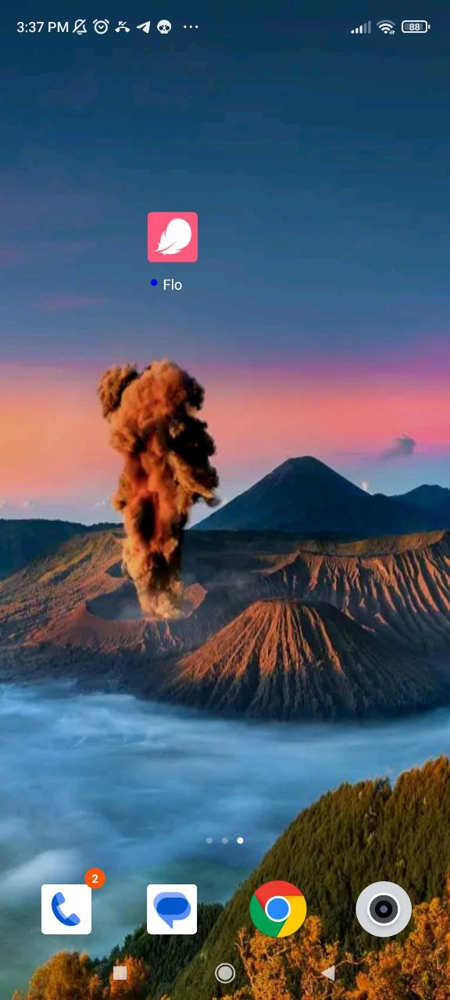

# **Flo Health - Period Tracker User Documentation**

### Welcome to Flo Health - Period Tracker, your personal mobile app for tracking your menstrual cycle, fertility, and overall reproductive health. This user documentation will guide you through the various features and functionalities of the Flo Health - Period Tracker mobile app. Let's get started!
 

 
 

 > ## **Table of contents**
  

1. Installation and account setup
2. Entering menstrual cycle data
3. Tracking menstrual cycle
4. Recording symptoms and moods
5. Health insights and articles
6. Settings and customization
7. Troubleshooting
 

> ## **1. Installation and account setup**
 

1. Open your device's application store. For iOS devices, this would be the Apple App Store, and for Android devices, it would be the Google Play Store.

2. Search for "Flo Health - Period Tracker" in the application store's search bar. Make sure you have an active internet connection for the search to work properly.
   

1. Once you find the Flo Health - Period Tracker app in the search results, tap it to open the app's details page. Review the app's description, ratings, and reviews to ensure it meets your requirements.

2. On the app's details page, you should see an "Install" or "Get" button. Tap it to initiate the download and installation process. Depending on your device's settings, you may be prompted to enter your Apple ID password (on iOS) or confirm installation permissions (on Android).

3. Wait for the download and installation process to complete. This may take a few moments, depending on your internet connection speed.

4. Once the app is installed, you can find its icon on your device's home screen or in the app drawer. Tap the app's icon to launch Flo Health - Period Tracker.
5. 

 

> ## **2. Entering menstrual cycle data**
 

* To accurately track your menstrual cycle, enter the start and end dates of your periods.
* Tap the **+** icon on the calendar and select the start date of your period.
* If your period lasts multiple days, adjust the duration accordingly.
* Click **Save** and your period will be recorded on the calendar.

 

 > ## **3. Tracking menstrual cycle**
 

* The calendar view displays your menstrual cycle, fertility window, and predicted ovulation dates.
* The app calculates the average length of your cycle based on your entered data and predicts future periods.
* Tap a specific date to view more detailed information about that day, including symptoms and moods.

 

> ## **4. Recording symptoms and moods**
 

* Flo Health - Period Tracker allows you to record and track various symptoms and moods throughout your cycle.
* Tap the **+** icon on the calendar or the **Add** button on the symptoms page to record a new symptom or mood.
* Choose from a wide range of predefined symptoms or add custom ones.
* You can also rate the intensity of symptoms and add notes for reference.

 

> ## **5. Health Insights and articles**
 

* Flo Health - Period Tracker offers a wealth of information and educational resources about women's health.
* Explore the **Insights** section to access articles, tips, and expert advice on topics such as menstrual health, fertility, pregnancy, and more.
* Stay informed about the latest research, trends, and advancements in reproductive health.
  
 

> ## **6. Settings and customization**
 

* Explore the app's settings to customize your experience and personalize the app according to your preferences.
* Adjust settings related to notifications, reminders, cycle length, and period predictions.
* You can also enable or disable specific features like symptom tracking or birth control tracking.
* Take some time to explore the settings and make adjustments as needed.

> ## **7. Troubleshooting**
 

*If you encounter any issues or have questions while using Flo Health - Period Tracker, here are some troubleshooting tips:*

* **Check your internet connection:** ensure that your device is connected to a stable internet connection for proper app functionality and syncing data.
* **Update the app:** keep Flo Health - Period Tracker updated to the latest version available in your app store. Updates often include bug fixes and improvements.
* **Restart the app:** if you experience any glitches or unexpected behavior, try closing the app and reopening it. This can help resolve minor issues.
* **Clear app cache:** if the app seems slow or unresponsive, clearing the app cache can help. Go to your device's settings, find the app settings for Flo Health - Period Tracker, and clear the cache.
* **Contact support:** if you're experiencing persistent issues or have specific inquiries, reach out to Flo Health's support team. Look for the **Support** or **Contact Us** option within the app settings or visit the official Flo Health website for support channels.

 

Remember, Flo Health - Period Tracker is designed to help you better understand your menstrual cycle and reproductive health. It's always a good idea to consult with healthcare professionals for personalized advice and guidance regarding your specific health concerns.